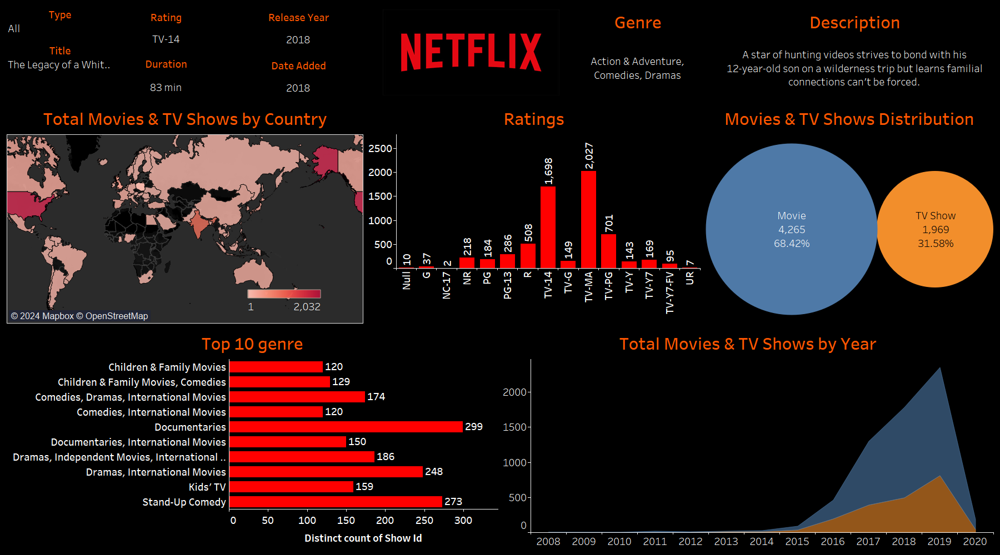

# 🎬 Netflix Movies and TV Shows Dashboard 🎥

## Overview
Netflix is a subscription-based streaming service that allows our members to watch TV shows and movies without commercials on an internet-connected device. 

## ✨Insight

- Netflix has released 3.735 of Movies and 1.955 of TV Shows from 1945-2022 (67 years), with the number of movies almost twice the number of TV Shows. 
- US, India and Japan are the countries that produce the most titles.
- For the last decade, the highest release of Movies title is in 2019 with 540 of titles and 306 of TV Shows in 2020. There is an increase in film released and it peaked in 2019, then there was a sharp decline start in 2022. 
- There are 11 of age certification. While, the most titles are in TV-MA rating, followed by R rating. It means that the customer segment that suitable for Netflix is for people above 17 years old.
- The most titles are between 90-120 minutes in duration with 1.823 of titles, followed by titles in between 30-60 minutes duration.
- The highest number of actors who participated in titles was in 2019 with 8.892 actors.
- The highest number of directors who participated in titles was in 2019 with 623 actors. While Raul Campos become the director who directed the most films with 21 titles.
- The IMDb score of the titles vary from minimum in 1.5 and the highest in 9.6.

## 🌈🌈Visualization
Tableau : [here](https://public.tableau.com/views/Book1_16591622785090/netflixdashboard?:language=en-US&:display_count=n&:origin=viz_share_link)

